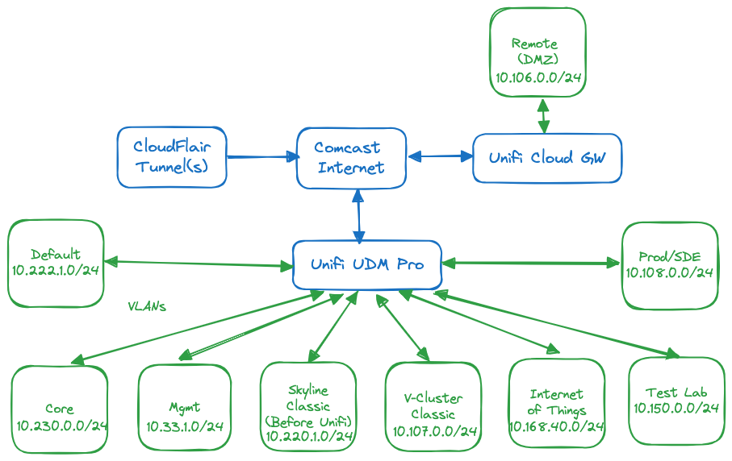

Home Lab 2024
============================================

High Level Overview
--------------------------------------------
Physical Network Layer
All Unifi (Unless otherwise specified) 

Basement:
- UDM Pro
- Switch 8 PoE 60 Watt 
- U6 Lite (Access Point) 

Main Level:
- Office USW 24
- Cloud(Lab) USW 24  
- 10GBE SFP+ USW Aggregation 
- U6 Pro (Access Point)
- MikroTik CRS309 10GBE SFP+ 8 Port 

Upstairs:
- Switch Lite 8 PoE
- Access Point AC Lite


Network Diagram  

```
Default                             10.222.1.0/24   VLAN: 1
Management                          10.33.1.0/24    VLAN: 33
Skyline Classic                     10.220.1.0/24   VLAN: 220
V-Cluster (Cloud)                   10.106.0.0/24   VLAN: 106
V-Cluster (PBI)                     10.107.0.0/24   VLAN: 107
Test Lab                            10.150.0.0/24   VLAN: 150
InternetOfThings                    192.168.40.0/24 VLAN: 40
--------
```
### Environments/Domains/VLANs

#### Physical Layer

#### Default Environment
-------
Subnet: 10.222.1.0/24  
DNS Domain: None  
Compute: 1 or 2 PIs for DNS

This subnet consist of newtworking equipment and makes up the "backbone" of the network. Will also have 1 - 2 DNS Appliances (PIs)


#### Core Domain
-------
Subnet: x.x.x.x/24  
DNS Domain: *.core.skyline-lab.com  
Compute: 
- 3 Node Proxmox HA Cluster (Low Power - Dell Micro)
- NAS

Power: Always On

This subnet consist of services that are critical and shared for all environments. These are:
- Internal DNS (Source of Truth)
- User Auth (LDAP)
- Shared File Services 
- Outgoing Email
- Homepage
- Root CA (ACME)
- Password Manager
- SSL Reverse Proxy
- Cloud Storage (Sync) 
- Proxmox Backup Server (On NAS)

Cluster Notes:  
Use 3 Dell Optiplex Micro 7050 (64GB, 1TB NVMe - 2TB Data). Single NIC. Ceph Cluster (Maybe)


#### PBI Lab Domain
-------
Subnet: x.x.x.x/24  
DNS Domain: *.prod.skyline-lab.com  
Compute: 
- Single Proxmox Node (Minisforum MS-01 i9-13900H $679)
- NAS

Power: Always On  
This is production quality Software Development Environment. Described [PBI Lab](docs/lab-pbi/lab-pbi.md)


#### Test Lab Domain
-------
Subnet: x.x.x.x/24  
DNS Domain: *.test.skyline-lab.com  
Compute: 
- 2 Proxmox Node Cluster
    - Dell T7920
    - Dell T7910
- NAS

Power: On Demand (Wake on LAN)

#### Remote/DMZ
-------
Subnet: x.x.x.x/24  
DNS Domain: *.test.skyline-lab.com  
Compute: 
- 2 Proxmox Node Cluster
    - Dell T7920
    - Dell T7910
- NAS

#### IOT Environment
-------
Subnet: 192.168.40.0/24 
DNS Domain: *.iot.wallyworld.lan  
Compute: None

This subnet consist of untrusted internet enabled devices.

#### Management Subnet
-------
Subnet: 10.33.1.0/24 
DNS Domain: *.mgmt.wallyworld.lan  
Compute: None

This subnet consist of Device Management Interfaces, KVMs, Lights out Management (iDRAC)

#### Internal Environment
-------
Subnet: 10.220.1.0/24  
DNS Domain: *.internal.wallyworld.lan  
Compute: None

This subnet consist of User's client devices. For example my laptop