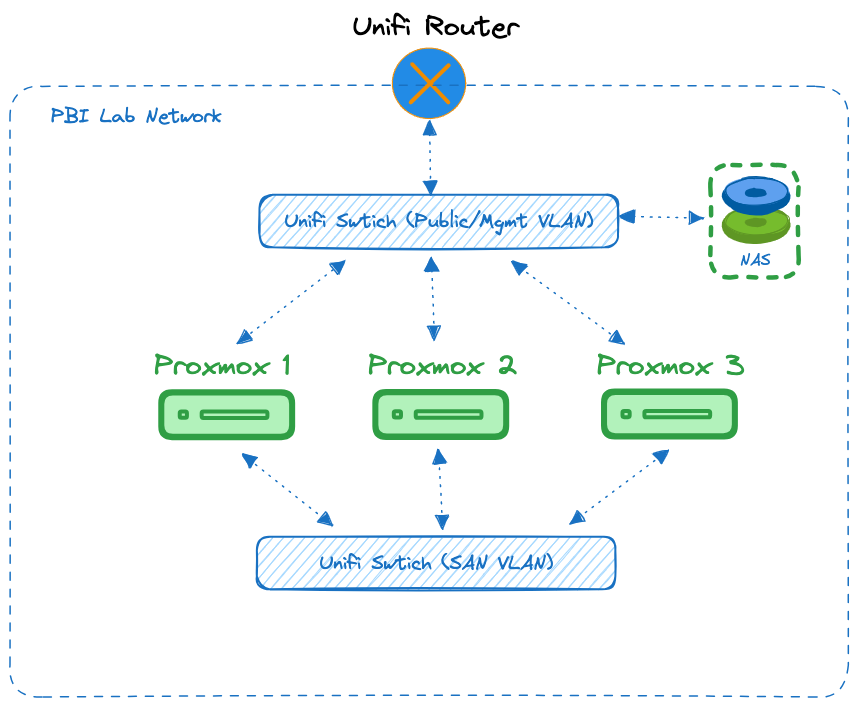

PBI LAB
====================================================

Overview
----------------------------------------------------
The PBI Lab is a "production" level/quality Software Development Lab. It consists of Dev CI/CD Pipelines, Code Hosting, and Test Environments. 

This environment is considered and treated as production. Data loss is not acceptable and maximum uptime is required. This environment is always on, so minimizing power usage is an high priority. 

Current Status
----------------------------------------------------
Current the environment consists of a Single Dell R210ii server and a QNAP NAS. The server has been modified to be quite (it sits next to me in my home office) and converted to be lower power than normal. This was done via Noctua fans and switching the CPU to a 45 watt Xeon E3-1260L, and a 1TB SATA SSD mirror. 

It runs VMWare ESXi, which is now suddenly a problem with the Broadcom buyout. Broadcom has kicked us Home Labbers square in the nuts by removing the free version. I've bought the VMUG subscription about 3 times in the past, but that was when I was also using VMWare Workstation on various machines. 

The NAS doesn't do much, pretty much just a low power data backup device and I store some shared "lab" files there. 

Updates in Progress
----------------------------------------------------
The main goal is to rid myself of VMWare ESXi. I'm also strapped for memory. The R210ii maxes out at 32GB RAM. I have some VMs turned off because of that. Some of the big goals are:

- Migrate from ESXi
- Hardware that can support at least 64GB RAM
- Low power
- Low noise
- Highly Available
- No data loss
- Working SSL (Hate Cert Errors and everything seems to need ssl these days)
- Get to Web UIs with standard ports https://jenkins.skyline.lan:9000 should just be https://jenkins.skyline.lan

#### Direction Decided
The new system will be built around a 3-Node Proxmox hyper converged cluster. The cluster will be built around 3 Dell Optiplex 7050 Micro business desktops. The micro version is a "1 liter" super small form factor. The Optiplex is equipped with an Intel i5-7500T processor. Here's how it compares with the old system

|processor|watts|cores|threads|Single Core Score|Multi Core Score|
|---------|-----|-----|-------|-----------------|----------|
|Xeon e3-1260l|45w|4|4|1457|4061|
|Core i5-7500t|35w|4|4|1931|5345|

There is still room to upgrade to the i7 version with 4c/8t. However given the 25% uplift over the current box, I suspect this will be fine. 

As far a NAS is concerned, I suspect my NAS will play a bigger role in the new system. Have not decided on a product yet. But I have tested everything and seems like nothing makes me happy 100%. I need to:

- Store a large amount of VM Backups (4 drives is enough)
- Run at least 1 virtual machine (Backup Server Software)
- Maybe run a few supporting containers.

Things I've own and have tried:

- QNAP
    - Best virtualization app. Containers seem to have a working Macvlan config 
- Synology 
    - Running Jellyfin for the house - works great.
    - Not so great at Docker Containers, no Macvlan
    - Lots of 1st party apps, including Hybrid backup that can backup my ESXi server
    - Low power hardware
- ASUStor
    - Awesome Powerful hardware at fair price.
    - Absolute worse Software. Uses Virtual Box PHP Web admin and Portainer. I can't even set VMs to autostart on reboot. And there's always a firmware update.    
- UnRaid
    - Not sure what to think. Not happy about the new license, happy I'm grandfathered into the old license. I don't think their future customer base is going to like a subscription model and this could die out. 
    - Since this runs on your own hard, It never seemed as seamless as it should be, when it comes to an "appliance". I've also had a usb thumb drive fail on me in a Free/TrueNas box before. So Its a little worrisome that its required to be installed that way. 
    - Great support for VMs and Containers. Large 3rd party community apps. 
- ZimaBoard/CasaOS (This gives me insight of what a ZimaCube would be)
    - Super nice UI
    - Easy to add docker apps
    - No VMs
    - Not much of a NAS
- OpenMediaVault
    - Too much work. 
    - Linux Multidisk wasn't too stable for me
- TrueNAS
    - Everyone's favorite
    - I personally ran Plex on Free/TrueNAS for many years. 
    - Hate ZFS for this application. I'll take a small performance hit for easy disk expandability. 
    - TrueNAS VM support seems a little goofy.
    - Like the Docker/K8S integration. For the most part.      

PBI Lab Network Diagram
----------------------------------------------------

#### VLAN Information
Lab Networks 

|Network|IP|VLAN|
|-------|-------|-------|
|PBI Public| 10.150.0.1/24| VLAN: 150|
|PBI SAN| 10.150.10.1/24| VLAN: 1150  

Public DHCP Range: 10.150.0.230-254

#### Hardware IP Information

|Hostname|Function|IP|Network Port|
|-------|-------|-------|-------|
|gw.pbi.skyline.lan|Default Gateway| 10.150.0.1|Cloud 17|
|nas-pbi.pbi.skyline.lan|Network Attached Storage| 10.150.0.5|
|NAS Actual (Temp)|Network Attached Storage| 10.220.1.14|
|pve1.pbi.skyline.lan|Proxmox VM Host #1| 10.150.0.21|Cloud 21|
|pve2.pbi.skyline.lan|Proxmox VM Host #2| 10.150.0.22|
|pve3.pbi.skyline.lan|Proxmox VM Host #3| 10.150.0.23|
|pve1-ceph.pbi.skyline.lan|Ceph NIC1| 10.150.10.11|
|pve2-ceph.pbi.skyline.lan|Ceph NIC2| 10.150.10.12|
|proxmox-backup.pbi.skyline.lan|Proxmox Backup Server(virt)| 10.220.1.22|

#### NAS Shares
- ISO (ISO Images)
- PROXMOX-BACKUP (VM/DATA Backups)

#### Infrastructure Service IP Information
|Hostname|Function|IP|
|-------|-------|-------|
|ns1.skyline.lan|DNS Server 1| 10.150.0.2|
|proxy.skyline.lan|NGINX Proxy Manager| 10.150.0.50|
|XXXX.skyline.lan|LDAP (GLAuth)| 10.150.0.51|
|XXXX.skyline.lan|Local DNS| 10.150.0.XX|
|XXXX.skyline.lan|ROOT CA| 10.150.0.XX|
|XXXX.skyline.lan|K3S Node 1| 10.150.0.XX|
|XXXX.skyline.lan|K3S Node 2| 10.150.0.XX|
|XXXX.skyline.lan|K3S Node 3| 10.150.0.XX|
|XXXX.skyline.lan|Docker Host| 10.150.0.XX|
|XXXX.skyline.lan|Rancher| 10.150.0.XX|
|XXXX.skyline.lan|Dashboard| 10.150.0.XX|
|XXXX.skyline.lan|APT Mirror| 10.150.0.XX|
|XXXX.skyline.lan|Code Server (Coder)| 10.150.0.XX|
|XXXX.skyline.lan|Virtual Workstation| 10.150.0.XX|
|XXXX.skyline.lan|Password Management (BitWarden) | 10.150.0.XX|

Applications Provided
----------------------------------------------------

#### Application IP Information

|Hostname|Function|IP|
|-------|-------|-------|
|XXXX.skyline.lan|Git Server | 10.150.0.XX|
|XXXX.skyline.lan|Artifact Repo| 10.150.0.XX|
|XXXX.skyline.lan|Container Registry| 10.150.0.XX|
|XXXX.skyline.lan|Jenkins Master| 10.150.0.XX|
|XXXX.skyline.lan|Jenkins Node 1| 10.150.0.XX|
|XXXX.skyline.lan|Jenkins Node 2| 10.150.0.XX|
|XXXX.skyline.lan|Test SQL Database| 10.150.0.XX|
|XXXX.skyline.lan|Test MongoDB| 10.150.0.XX|
|XXXX.skyline.lan|Test Mock Server (leaf/navara)| 10.150.0.XX|
|XXXX.skyline.lan|Test File Transfer Server (SFTPGo)| 10.150.0.XX|

#### CI/CD Server (Jenkins)

The SDE provides [Jenkins](https://www.jenkins.io) as the CI/CD solution. It will consist of a single master node and two workers. Click for [SDE Jenkins](app-jenkins.md) details.
