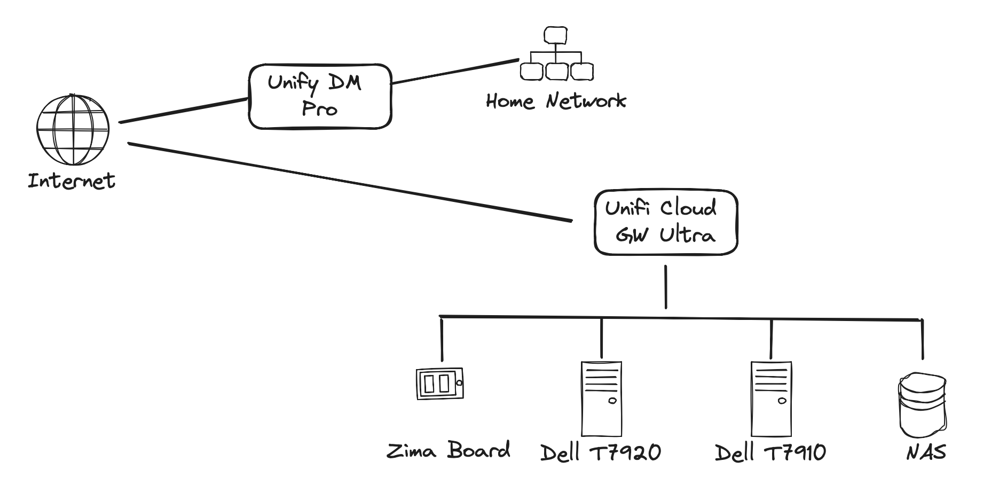

Remote Test Lab
====================================================

Overview
----------------------------------------------------
This lab is for remote access testing. It consists of an isolated network and acts as a co-location site within the same location as the main network.

Proof of Concept (nope straight to prod)
----------------------------------------------------
Using an SBC (ZimaBoard with dual NICs), will install OpnSense. This will act as a gateway. On the LAN side, a Server will be directly connected.   
Features:  
1. Wireguard VPN
2. Proxmox Server
3. Remote Desktop (Virtual)
4. Cloudflare Tunnel for Hosted Services

Production
----------------------------------------------------
1. Unifi Cloud GW Ultra
    - WAN 173.14.18.21 (gw 173.14.18.22 nm 255.255.255.248)
    - LAN 10.106.0.0/24
    - *.cloud.skyline-lab.com
    - Site to Site VPN
    - Wireguard VPN
    - Cloudflare Tunnel

2. Zima Board - Always on Services
    - DNS PiHole
    - Outgoing Email
    - Mesh Commander - vPro Mgmt
    - Nextcloud
3. Dell T7920 - VHost
    - Rancher Harvester
    - Xeon Silver 4114x2 (10c/20t 40t total)
    - 96GB RAM
    - 256GB NVMe + 1TB NVMe + 0 NVMe
4. Dell T7910 - VHost
    - KVM Host for Cloudstack
    - Xeon E5-2690v4x2  14-Core/28-Thread
    - 192GB RAM
    - Check storage
5. NAS
    - Temp - UnRAID (Super Micro X10SDV-4C-TLN2F)    
    - Perm - UGreen 6 Bay DXP6800 Pro
    - SMB/NFS
    - MinIO

Phase 2
----------------------------------------------------
1. Add Unifi 10g Switch
2. Add Unifi WAP

Services
----------------------------------------------------
- DNS (PiHole)
- Outgoing Email (Look at docker mailserver)
- LDAP (glauth)
- Mesh Commander
- Nextcloud
- Bitwarden
- Git (GitTea)
- Jenkins
- Artifactory CR
- Artifactory MVN
- Code Server
- Kasm Workspaces
- Rancher
- Debian APT Mirror (or apt-cacher)
- Auth Server (MFA - Authentik/keycloak)

