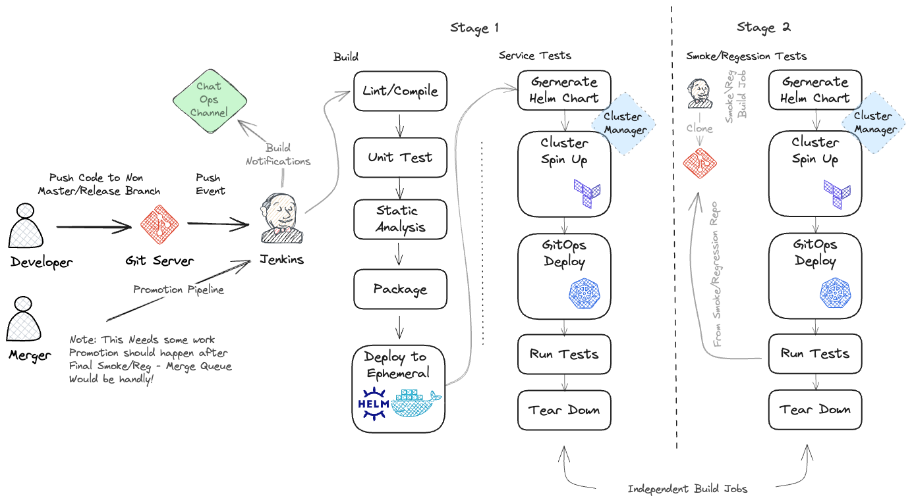

Software Development CI CD Pipeline
====================================================

Overview
----------------------------------------------------

Notes/Ideas:
----------------------------------------------------
- Before promotion use git commit ID as a version number
- Don't publish Build Artifacts until pipeline is complete (jar, py, etc) Docker/Helm need to be published into Ephemeral Repos 
- QUESTION: Are the services API exposed outside of the cluster for testing? This would be needed for the build server to run test synchronously. Might need something like JenkinsX that is k8s native
- Add Chat OPs to the pipeline
- One current strategy is to have an environment per branch
    - develop
    - master
    - release X
    - feature/bug (dynamically spun up)
    - copy existing dev/prod artifact repos into ephemeral and overlay new artifacts
- Might need a better way to templatize helm charts
- For tests within the cluster. Maybe a special proxy container that can proxy the rest requests inside and respond as the container under test. How about teleport?
- Does Argo or Spinnaker have an API for deployments?
- Need a "Cluster Manager" The CM acts as a semaphore for available cluster resources. Takes commands to spin up/down clusters, show status. Typically this is something like AWS
- Need a Dashboard to the see the entire system build status as a whole, when too many services are being built, hard to keep track of whats failing
- Version Numbers for artifacts inside containers (ie Jars). Seeing commit ID being used version = <DATESTRING>-<TIMESTAMP>-<BUILDNUMBER>-<COMMIT-ID>

##### Possible Tools to look at
- Harbor
- ttl.sh 
- ArgoCD
- Artifactory (Free)
- Dagger
- Selenium
- Kustomize
- Terraform
    - Kubernetes
    - Artifactory